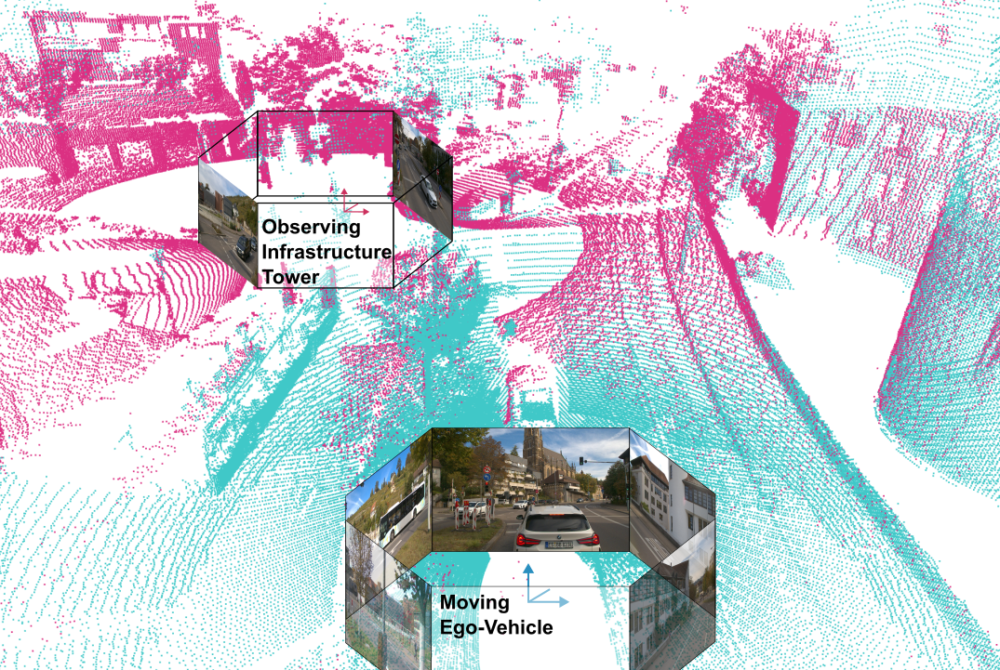

# **CoopScenes** 🚗📡   
**Multi-Scene Infrastructure and Vehicle Data for Advancing Collective Perception in Autonomous Driving**  

[](LICENSE) [](https://coopscenes.github.io/) [](https://arxiv.org/abs/2407.08261)  

## 🚀 **Overview**  
The **CoopScenes dataset** is a large-scale, multi-scene dataset designed to support research in **collective perception,
real-time sensor registration, and cooperative intelligent systems** for urban mobility. The dataset features **synchronized 
multi-sensor data** from both an ego-vehicle and infrastructure sensors, providing researchers with high-quality data for
machine learning and sensor fusion applications.


### 📌 **Key Features**  
✔ **104 minutes of synchronized data** at **10 Hz**, totaling **62,000 frames**  
✔ **Highly accurate synchronization** with a mean deviation of **2.3 ms**  
✔ **Precise point cloud registration** between the ego-vehicle and infrastructure sensors  
✔ **Automated annotation pipelines** for object labeling  
✔ **Open-source anonymization** for faces and license plates with [BlurScene](https://github.com/CoopScenes/BlurScene)  
✔ **Diverse scenarios:** public transport hubs, construction sites, and high-speed roads across **three cities in Stuttgart, Germany**  
✔ **Total dataset size:** **527 GB** in **`.4mse`** format, accessible via our development kit  

## 📥 **Download**
The dataset can be accessed via official [CoopScenes](https://coopscenes.github.io/) website and used with our development kit.

📢 **INFO:** The data will be fully published upon the official publication announcement.

## 🔧 **Installation & Usage**  
To use the dataset, simply install our provided PyPi package:
```bash
    python3 -m pip install CoopScenes
```

```bash
    git clone git@github.com:MarcelVSHNS/CoopScenes.git
    python -m venv venv # install with apt-get install python3-venv
    source ./venv/bin/ activate
    pip install -r requirements.txt 
```

#### Sample Implementation
You can find detailed examples in the [Colab](https://colab.research.google.com/drive/1p2cw3bSZ6B798qQ2jVnpvKQI5pv_-y_D?usp=sharing#scrollTo=aYpilA40LqDK) notebook.
```python
    import coopscenes as cs
    sample_record = cs.DataRecord("/content/example_record_1.4mse")
    frame = sample_record[0]
    frame.vehicle.cameras.STEREO_LEFT.show()    # PIL Image
```

## 📑 Citation
```
    @misc{vosshans2024aeifdatacollectiondataset,
        author    = {Marcel Vosshans and Alexander Baumann and Matthias Drueppel and Omar Ait-Aider and Ralf Woerner and Youcef Mezouar and Thao Dang and Markus Enzweiler},
        title     = {The AEIF Data Collection: A Dataset for Infrastructure-Supported Perception Research with Focus on Public Transportation},
        url       = {https://arxiv.org/abs/2407.08261},
        year      = {2024},
}
```

## 📜 **License**
This dataset is released under the **[MIT License](LICENSE)**.

## Acknowledgements


We gratefully acknowledge the **Ministry of Transport of Baden-Württemberg** for funding the [AMEISE project](https://ameise.wandelgesellschaft.de/).

---

**Enjoy using CoopScenes! 🚀**


